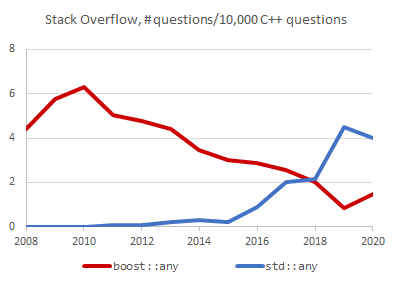
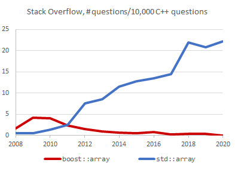
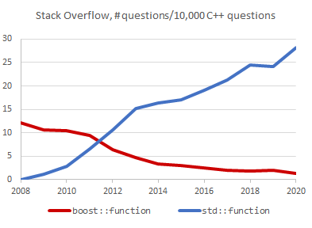
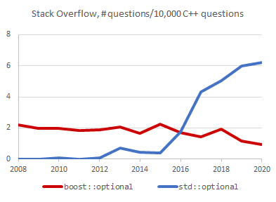

# Relevancy of Boost libraries vs. standard equivalents

As a crude way to assess how the importance of certain Boost libraries have varied
among the public with the introduction of equivalent components in the C++ standard, we have issued
Stack Overflow search queries of the form <code>"boost::X"&nbsp;created:YYYY</code> and
<code>"std::X"&nbsp;created:YYYY</code> for `YYYY` in 2008-2020. The tables below show
the number of results per annual 10,000 Stack Overflow C++-related questions (tag `[c++]`). Results for the current
year 2020 include questions up to May 17. In the case of
**Boost.MPL**, which does not have a proper standard library replacement in C++11, we compare
with **Boost.Mp11**.

